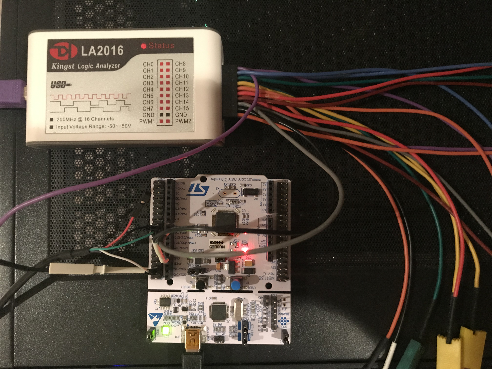
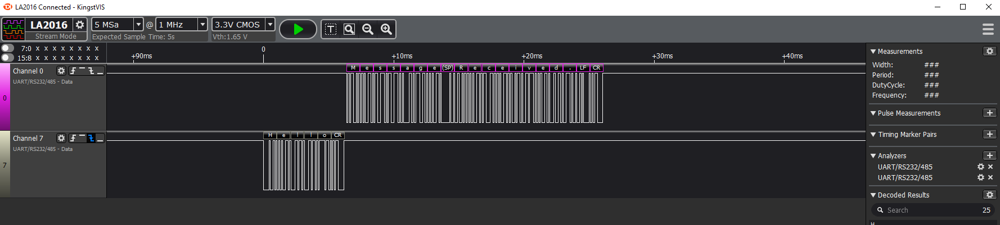
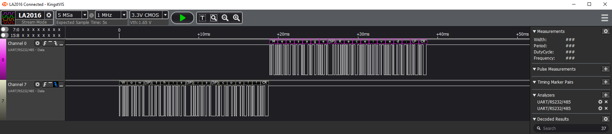
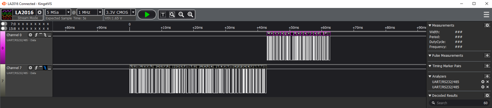

# STM32F4XX
This is an interrupt-based bare metal UART design on an STM Nucleo F446RE dev board.
Main Code is in UART/SRC/uart_demo.c
UART driver header and .c files are in UART/drivers/Inc and UART/drivers/Src

## Setup and Visual Demo
  
  
  
  
  
